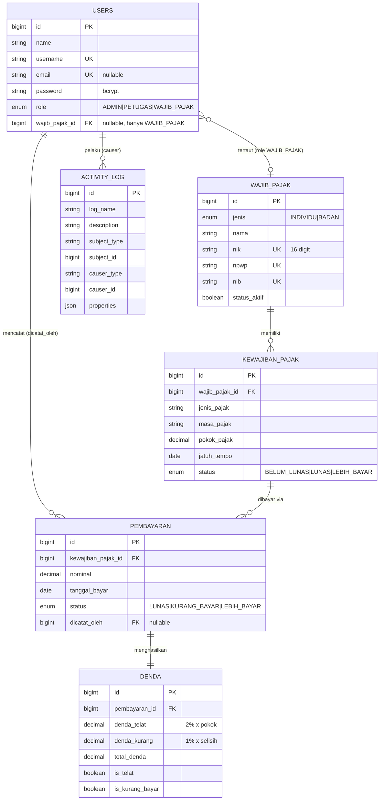

# ERD - Tax Processing System (TPS)

Diagram relasi antar entitas (render otomatis di GitHub via Mermaid).
Versi `.sql` lengkap tersedia di [`docs/erd.sql`](erd.sql).

## Catatan relasi

- **users.wajib_pajak_id** → menautkan akun login role `WAJIB_PAJAK` ke datanya sendiri
  (NULL untuk ADMIN/PETUGAS). Inilah dasar fitur "wajib pajak hanya melihat data sendiri".
- **wajib_pajak → kewajiban_pajak → pembayaran → denda**: rantai one-to-many,
  cascade-delete ke bawah; `denda` 1-1 dengan `pembayaran` (dihitung otomatis).
- **activity_log**: audit trail otomatis (Spatie) untuk setiap perubahan data.
